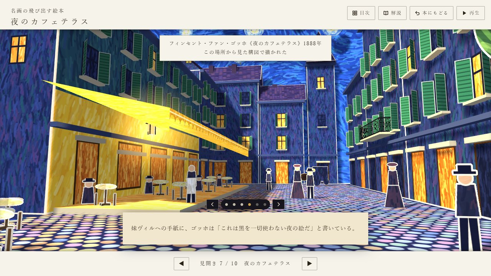
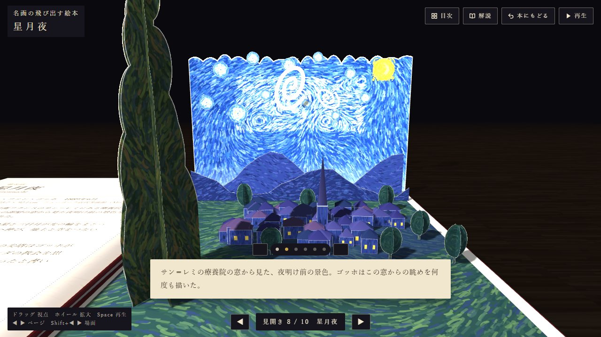

# 名画の飛び出す絵本 — Three.js だけで作る紙の立体（デモ）

🔗 **本番URL**: [https://popup-art-book.vercel.app](https://popup-art-book.vercel.app)



## これは何のリポジトリか

西洋の名画10作品を、**見開きごとに紙の立体として立ち上がる飛び出す絵本**にしたブラウザアプリです。左ページが解説、右ページが飛び出す街。見開きをタップすると部品が上の層から順に起き上がり、カメラが自動で俯瞰 → 回り込み → 通り → 画家の構図（額縁つき）と巡回します。

絵の筆致も紙の部品もすべてコードで描いており、**名画の画像ファイルは1枚も使っていません**。ビルドなし・依存は Three.js（CDN）のみの静的ページです。



## 見どころ（実装上の工夫）

- **畳み方まで計算した飛び出し**: 部品はページ内側へ倒れる平行四辺形の折り（y 軸を倒すせん断行列）。重なり順（layer）に従って畳み／起こすため、閉じた本の上でも部品がページからはみ出さず、相手のページに当たらない角度までだけ立ちます
- **実物の本のような構造**: 丸背の布表紙、厚紙の台紙、蝶番として曲がる根元、ばねで追従するページめくり
- **絵のプロシージャル生成**: Canvas 2D のブラシ関数（点描・筆致・石畳など）でテクスチャを生成。作品ごとに乱数の種を固定
- **カメラツアーの宣言的記述**: 各作品は `tour` に「時刻・カメラ位置・注視点・字幕・画角」を並べるだけ
- **軽さへの配慮**: 見開きは前後1つだけ組み立て、同一マテリアルのメッシュは結合、画面が変わらないときは描画しない、重い端末ではピクセル比を下げる（詳細は下の「処理を軽くするしくみ」）
- **スマホ・アクセシビリティ**: 指で押せるボタン、横向き専用レイアウト、切り欠き対応、`prefers-reduced-motion` 対応

## 技術スタック

JavaScript（ES2020, ビルドなし）/ Three.js r128（cdnjs）/ Canvas 2D / Python（目次サムネイル生成 `tools/make_thumbs.py`）/ Vercel（main への push で自動デプロイ）

## 起動方法

```bash
python -m http.server 8000
```

`http://localhost:8000/` を開いてください（Three.js は CDN から読み込むためネット接続が必要です）。開くたびに約10秒の OP が流れます。飛ばすには `?noop` を付けます。

## 既知の制約（デモ用途）

- 名画の再現ではなく「絵本としての見立て」です。人物・建物は紙細工風に簡略化しています
- 描画負荷が高く、低スペック端末ではコマ落ちします（影・多数のテクスチャ生成）
- 解説文は作品ごとの要点のみで、学術的な網羅を目的としていません
- 自動テストはなく、確認はヘッドレス Chrome のスクリーンショットで行っています

## ライセンス

MIT（[LICENSE](LICENSE)）

---

## 仕様の詳細

名画が飛び出す絵本。見開き1つで1作品(左ページに解説、右ページに飛び出す立体)。
開くと毎回 OP が流れ(表紙がひとりでに開き、扉の見開きで紙の劇場が立ち上がって、見開き1へめくれる。約10秒、飛ばせない、音なし)、そのあとは見開きをタップ(クリック)すると、部品が上の層から起き上がり、カメラが自動でめぐって、画家の構図の場面では額縁が出ます。

1. ジョルジュ・スーラ《グランド・ジャット島の日曜日の午後》(1884〜86)
2. ピエール＝オーギュスト・ルノワール《ムーラン・ド・ラ・ギャレットの舞踏会》(1876)
3. クロード・モネ《睡蓮の池と日本の橋》(1899)
4. サンドロ・ボッティチェリ《ヴィーナスの誕生》(1485年頃)
5. ピーテル・ブリューゲル(父)《バベルの塔》(1563)
6. アンリ・ルソー《夢》(1910)
7. フィンセント・ファン・ゴッホ《夜のカフェテラス》(1888)
8. フィンセント・ファン・ゴッホ《星月夜》(1889)
9. エドワード・ホッパー《ナイトホークス》(1942)
10. ルネ・マグリット《光の帝国》(1954)

## 操作

| 場面 | 操作 |
|---|---|
| OP の間 | 操作は受けない(UI も隠れる)。終わると見開き1で止まる |
| 閉じた本(表紙) | タップ(クリック)、Space、再生、▶ で表紙が開いて扉が出る(扉は平らなまま) |
| 本全体を見ているとき | ◀ ▶ (矢印キー)でページをめくる。めくり終えた見開きは平らで、タップ・Space・再生で絵が立ち上がり、同時に近くを巡るツアーが始まる。ページを移るとき(◀ ▶・目次・次の作品へ)は、絵を畳んでから(立ち上がりを逆にたどって約1.5秒)めくる。ツアー中ならカメラが戻る間に畳む |
| ツアー中 | 一時停止ボタン・タップ・Space・字幕のタップで一時停止/再開。‹ › と点、または Shift+◀ ▶ で場面を送る。一周すると「次の作品へ」が出る(最後の作品では「本を閉じる」) |
| カメラ | ドラッグで本のまわりを360°回せる(上下は机すれすれから真上まで)。ホイール・2本指のピンチで寄る/離れる。離しても視点はそのまま。ページをめくっても向きと距離は保つ。ツアー中に動かすと一時停止になり、再生で今の視点からツアーへ戻る。「本にもどる」でいつもの視点へ |
| いつでも | 「目次」でどの作品へも移れる。「解説」で左ページの解説を読める |
| スマホ | ボタンは指で押せる大きさ(40px 以上)。案内にカメラの動かし方(ドラッグで回す・2本指で拡大)を添え、一度動かすと消える。横向き(高さ 500px 以下)では、ツアー中はページ送りを隠して場面送りと字幕を下の1列に並べ、額縁の場面は上の帯だけにして題箋をその中に出す。切り欠きのある画面では絵を全面に描き、文字とボタンは安全な範囲に置く |

見開きは 扉 → 作品1〜10 の順。見開き10の次は裏表紙が重なって本が閉じ、◀(またはタップ)でもう一度開く。ページをめくっても URL は変わらず、読み込み直すと必ず OP から始まる(`?spread=N` 付きで開いても OP を流し、終わると見開き1。URL からも消す)。目次には作品だけが並ぶ。OS の「視差効果を減らす」(prefers-reduced-motion)が有効なときは、カメラを場面ごとに止め、めくりを短くする。

## 本の作り

- 表紙・裏表紙は布張りの板(厚さ0.3、ページより0.4ずつ大きい)。表紙の内側が扉の左ページ(はじめに)、裏表紙の内側が見開き10の右ページ
- 台紙は厚さ0.15の厚紙(2枚貼り合わせ)。小口に紙の層が見え、左右の束はめくった枚数だけ厚さが入れ替わる
- 背は丸背の帯で両方の表紙をつなぎ、台紙の付け根はその弧の上に並ぶ。台紙の根元(幅1)は蝶番として曲がり、のどに沈む
- めくる台紙は付け根のまわりを上を通って回り、向きはばねで追うので、持ち上げでは根元が先にしなり、着地で軽く跳ねる
- 飛び出しの部品は、相手のページに当たらない角度まで立つ(群ごとに「高さ / のどからの距離」を組み立て時に求める)

Three.js(r128, CDN)だけの静的ページ。絵の筆致や紙の部品はすべてプログラムで描いています(名画の画像は使っていません)。

構成: `index.html` → `js/common.js`(道具と共通部品、`BOOK.add` の説明、作品の一覧 `BOOK.list`) → `js/book.js`(本・めくり・カメラ) → `js/opening.js`(OP)。`works/NN_名前.js`(1作品1ファイル。`00_title.js` は扉)は、その見開きが要るときに `js/book.js` が読み込む。

作品を足すときは `works/` にファイルを置き、`BOOK.list` に1行足して、`python tools/make_thumbs.py` で目次のサムネイル(`thumbs/NN.jpg`)を作り直す。tick や extra で動かす部品には `userData.live=true` を付ける(動かない部品は同じマテリアルどうし結合するため)。

処理を軽くするしくみ: 開いている見開きと前後1つだけを組み立てて残す(前後は真上で待っている間に組み立てる)／テクスチャを GPU へ送ったら元の canvas を捨てる／影は部品が動くときだけ計算する(スマホでは影の解像度を 1024 に)／画面が変わらないときは描かない／重い端末ではピクセル比を下げる／OP で必ず使う扉・見開き1・表紙の絵は index.html で先読みする

確認用パラメータ(`?noop` か、下の `?t` `?pc` `?open` `?flip` `?view` `?auto` があるときは OP を流さない): `?noop`(OP を飛ばす。`?spread=N&noop` で見開きNから)、`?spread=N`(見開きN、0 は扉)、`?t=秒`(ツアーのその時点で停止。部品は立ち切った状態)、`?pc=秒`(立ち上がりの途中、0〜4.6)、`?open=度`(見開きの開き具合)、`?flip=0..1`(次へめくる途中で停止)、`?slow=倍率`(めくりをゆっくり)、`?view=x,y,z`(カメラを固定)、`?pr=数値`(ピクセル比を固定)
